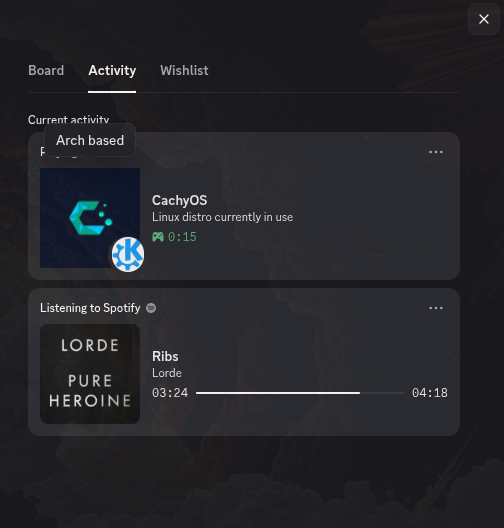
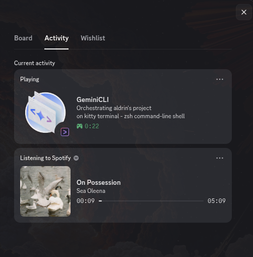
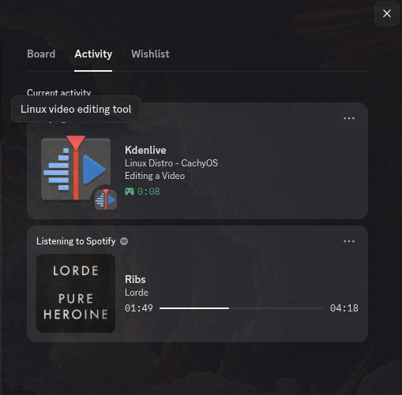
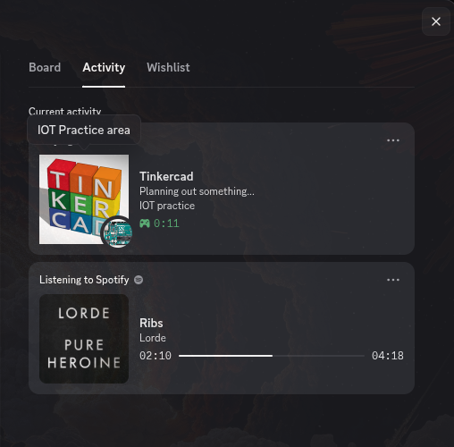

# Custom Terminal Discord Status

This is my personal setup for showing custom Discord Rich Presence statuses directly from the terminal in my linux environment (CachyOS). 

> [!IMPORTANT]
> This setup relies completely on the amazing program created by **trickybestia**. 
> You can find and install their original program here: [linux-discord-rich-presence](https://github.com/trickybestia/linux-discord-rich-presence.git). You must install their program first before using these custom scripts.

---

## How to Set This Up

### Create a Discord App
To make this work, Discord needs a unique ID number to connect your status to your profile.
1. Go to the [Discord Developer Portal](https://discord.com/developers/applications).
2. Click **New Application** and give it a proper name.
3. On the first page, copy your **Application ID** and paste it in this area of the script `[{"application_id": YOUR-APP-ID-HERE,`.
4. To add custom images go to **Rich Presence -> Art Assets** on the left menu. Upload the images you want to show on your profile (make the image dimensions exceeds 512x512 pixels). Give them short simple names make sure to remember them and place them in this part of the script `"large_image": {"key": "NAME-OF-THE-ART-ASSET-HERE",`.
5. To add some texts you can modify these areas as you wish `"details": "CUSTOM-TEXT-HERE", "state": "CUSTOM-TEXT-HERE",`

after these little tweaks you can run the command on your terminal "linux-discord-rich-presence -c "YOUR-SCRIPT-FILE-PATH-HERE"

# Screenshots

